# End-to-End Pipeline Map

## Frame flow

```mermaid
flowchart LR
    A["Simulation, scripts, physics"] --> B["Scene traversal, animation, visibility"]
    B --> C["D3D11 draw and state submission"]
    C --> D["Stereo geometry, depth, shadows, materials"]
    D --> E["Community Shaders feature passes"]
    E --> F["DLSS and final eye preparation"]
    F --> G["OpenVR Submit per eye"]
    G --> H["OpenComposite stores both eyes"]
    H --> I["xrEndFrame projection layer"]
    I --> J["Pimax compositor: warp, reprojection, composition"]
    J --> K["Headset transfer and scanout"]
```



## Stage ownership and observability

| Stage | Process/owner | Current observability | Main uncertainty |
|---|---|---|---|
| Simulation and scene update | `SkyrimVR.exe` | CPU profiler/ETW possible | Which main-thread spikes create late frames? |
| Draw preparation | `SkyrimVR.exe` | ETW, CPU sampling, hooks | How much work is repeated per eye? |
| D3D11 submission | Skyrim + NVIDIA UMD | GPUView/Nsight | Is the GPU continuously fed? |
| Game geometry/shading | NVIDIA GPU | GPU timestamps/counters | Which passes form the low-resolution floor? |
| Community Shaders | Skyrim + GPU | CS profiler/Tracy/RenderDoc | Exact RC3 per-pass P95 distribution |
| DLSS | Streamline/NVIDIA | CS markers and GPU trace | Cost by eye/rung/context transition |
| OpenComposite eye handling | `SkyrimVR.exe` bridge | Source/hooks; app GPU copy measured | Exact CPU/fence behavior per eye |
| OpenXR compositor | Pimax runtime process | ETW/GPUView required | GPU time and deadline admission are unmeasured |
| Distortion/reprojection | Pimax runtime/GPU | Runtime trace only | Work, queue priority, and scheduling reserve |
| Scanout | HMD/display system | No direct current signal | Which application frames were physically displayed? |

## Important timing boundaries

The Governor/Community Shaders application GPU bracket measures useful work inside
`SkyrimVR.exe`. It does not include every later GPU context owned by the Pimax
runtime.

OpenComposite receives separate OpenVR submits for the left and right eyes. It
stores them and calls the OpenXR submission path after both eyes are present. A
timestamp immediately before the original final-eye submit can therefore end
before OpenComposite's final copy/fence and before Pimax compositor work.

The measured post-submit application GPU work was only about 0.033–0.034 ms in
the RC3 capture. This refutes a large in-process OpenComposite copy cost. It does
not measure the out-of-process compositor.

## Deadline model

At 72 Hz:

```text
display period = 13.8889 ms
```

But a frame does not necessarily own that complete period. The OpenXR runtime may
reserve time for composition, distortion, reprojection, and scanout scheduling.
The effective application deadline can therefore be earlier than the next scanout
boundary.

A frame can fail in at least four distinct ways:

1. **GPU throughput failure:** GPU work itself exceeds the useful deadline.
2. **CPU/feed failure:** the GPU has idle bubbles while waiting for commands.
3. **runtime admission failure:** work finishes but arrives too late for the target
   display interval.
4. **compositor contention:** another GPU context consumes time outside the
   application bracket.

The measurement program must label these separately.

