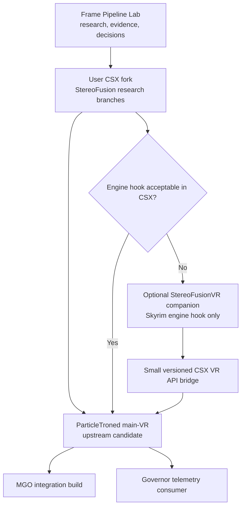
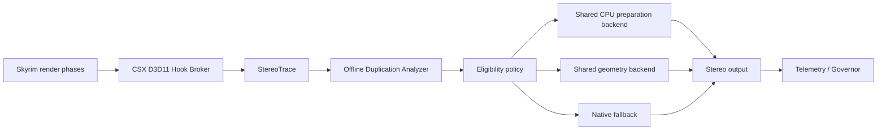

# StereoFusion Implementation Roadmap

Status: **proposed execution plan for Claude and ParticleTroned review**  
Date: 2026-08-17  
Product goal: **shared stereo scene preparation and geometry with native-quality eye output**

## Executive decision

Do **not** start from scratch, and do **not** begin with an independent plugin that
detours the same D3D11 context as Community Shaders.

Start from a user-owned fork of
[ParticleTroned Community Shaders](https://github.com/ParticleTroned/skyrim-community-shaders):

1. pin the research baseline to immutable tag `CSX3.18`, commit
   `2051e2aead1b2bb2b03faa421201376e8bc84fe0`, because that matches the current
   MGO RC3 measurement target;
2. implement only passive observation first, reusing/extracting CSX's existing
   D3D11 hook and frame-diagnostic infrastructure;
3. prove the duplicated layer and choose a backend from evidence;
4. develop the smallest eligible opaque geometry path inside the CSX fork;
5. forward-port the proven patch series to ParticleTroned's current `main-VR`;
6. propose upstream integration behind developer/experimental gates;
7. create a separate SKSE companion only if Skyrim engine-level hooks cannot be
   accepted or cleanly owned by CSX.

The working product name is **StereoFusion**. The name is provisional; the
architecture is the decision.

## 1. What we are building

StereoFusion is not whole-frame mono reprojection. Its primary contract is:

```text
prepare shared scene work once
submit eligible geometry once where feasible
project it correctly into both eyes
shade both eyes natively where view dependence matters
fall back to Skyrim's original path for anything uncertain
```

Existing feature-local CSX reprojection for diffuse GI and screen-space shadows
can remain as an optional complementary layer. Whole-frame right-eye color
replacement is not the foundation.

### Player-facing success

The intended result is the same stereo image with less repeated work:

- stable 72 Hz in substantially more MGO scenes;
- one or two higher Governor quality rungs when headroom permits;
- better P95/P99 frame delivery;
- no render-scale relatch freeze;
- no per-HMD resolution table or Pimax preset dependency;
- automatic native fallback for incompatible content.

### Engineering success

Before release, the implementation must demonstrate one of these on the true
critical path:

```text
>= 2.0 ms P95 end-to-end application saving, or
>= 20% P95 render-thread saving with a demonstrated delivery improvement
```

Smaller results can still justify upstream tracing or pass-local improvements,
but not the full StereoFusion product claim.

## 2. Why the CSX fork is the correct starting point

CSX 3.18 already owns or understands:

- `D3D11CreateDeviceAndSwapChain` interception;
- the immediate D3D11 device context;
- Skyrim `BSGraphics::SetDirtyStates` and shader-technique hooks;
- current shader/permutation identities;
- frame IDs and per-frame phase diagnostics;
- Tracy D3D11 collection and Community Shaders profiling;
- VR camera data and side-by-side eye layout;
- actual submitted-eye preparation and render-scale epochs;
- D3D11 developer hooks for all major `Draw*`, `Dispatch*`, resource updates,
  copies, clears, deferred contexts, and command-list execution.

An independent plugin would have to rediscover this state and chain detours with
CSX. That increases hook-order, recursion, teardown, overlay, and resource-lifetime
risk without creating player value.

CSX is GPL-3.0-or-later with the repository's Modding and Linking Exceptions.
Forking and publishing modifications is the intended legal route, provided the
license, exceptions, attribution, source availability, and third-party binary
licenses are preserved.

## 3. Repository and ownership model



### Frame Pipeline Lab

The existing
[Skyrim VR Frame Pipeline Lab](../README.md) remains the source of truth for:

- immutable configuration signatures;
- hypotheses and decisions;
- experiment protocols and raw-capture indexes;
- compatibility and visual evidence;
- go/no-go decisions.

It does not contain production renderer code.

### User CSX fork

The fork contains:

- tracing and analysis hooks;
- experimental eligible-draw classification;
- shared-preparation and geometry backends;
- diagnostic UI and telemetry;
- shader changes and GPU tests;
- release candidates for Claude and ParticleTroned review.

### Optional companion plugin

Do not create this initially. It becomes justified only if the selected optimization
must hook Skyrim functions above CSX's acceptable ownership boundary.

If created, it owns only:

- reverse-engineered Skyrim visibility/draw-packet hooks;
- version-address validation;
- a small exchange of packet/eye/epoch metadata through a versioned CSX VR API.

It must not independently own Community Shaders resources, replace CSX shaders,
or detour the same D3D11 methods.

### Governor

The Governor remains a separate controller. StereoFusion exposes measurements;
the Governor does not decide whether an individual draw is stereo-safe.

Later telemetry may include:

```text
mode
configuration_epoch
eligible_draw_fraction
paired_draw_fraction
fallback_count_and_reason
estimated_cpu_ms_saved
measured_gpu_ms_saved
validation_faults
```

## 4. Base and branch policy

As of 2026-08-17:

```text
released research baseline:
  tag    CSX3.18
  commit 2051e2aead1b2bb2b03faa421201376e8bc84fe0

ParticleTroned default branch:
  branch main-VR
  commit a0a6218b0606a3e6f5f19c599880703eedf2dd9a
  relation to CSX3.18: 11 commits ahead at time checked
```

Do not start from the older active local worktree or the diverged `csx-3-VR`
branch merely because they are present locally.

Recommended branch series in the user fork:

```text
stereofusion/trace-csx318
stereofusion/classifier-csx318
stereofusion/poc-opaque-csx318
stereofusion/integration-main-vr
```

Each branch should contain small reviewable commits. Do not mix tracing,
optimization, UI, Governor API, and unrelated CSX fixes in one commit.

### Two-base rule

- Use `CSX3.18` for reproducible MGO RC3 A/B measurement.
- Use current `main-VR` for the eventual upstream/release candidate.

The implementation must pass the same tests after forward-port. A gain that only
exists on a stale research base is not releasable.

## 5. Architecture



### 5.1 D3D11 Hook Broker

CSX currently has extensive D3D11 developer tracing embedded in its upscaling/menu
implementation. StereoFusion must not install a competing hook chain.

Preferred evolution:

1. inventory the current hook methods and consumers;
2. extract only the generic installation/chaining mechanism into a shared internal
   broker without changing menu-trace behavior;
3. make existing menu tracing the first broker subscriber;
4. add StereoTrace as a second subscriber;
5. preserve original function ordering and no-throw behavior;
6. prove capture equivalence before adding new events.

If extraction is judged too risky, extend the existing hook bank with a narrowly
scoped observer callback first. Do not duplicate detours.

### 5.2 StereoTrace

StereoTrace is passive and bounded. It records:

- frame and configuration epoch;
- engine/CSX phase and eye confidence;
- every actual draw/dispatch kind and arguments;
- pipeline, geometry, resource, and eye-variant signatures;
- resource update generations for dynamic constant buffers;
- CPU timing samples and selected GPU query ranges;
- event loss and observer overhead.

It never suppresses a command.

### 5.3 Duplication Analyzer

The analyzer runs outside the game. It aligns left/right command sequences and
reports:

```text
exact paired draws
same geometry with expected eye-only differences
same material but different geometry
unmatched/unknown draws
transparent/order-sensitive draws
CPU time and estimated geometry per class
GPU phase timing and idle regions
```

The analyzer output selects the backend; it does not merely confirm the original
hypothesis.

### 5.4 Eligibility policy

The first allowlist is deliberately small:

```text
opaque
non-alpha-tested
non-transparent
non-POM
non-tessellated
non-UAV-writing
non-order-dependent
known CSX shader family
outside conservative near field
stable paired geometry/resource signature
validated stereo phase
```

Unknown means native Skyrim rendering.

### 5.5 Backend ladder

Backends are attempted in order of correctness and reachability:

1. **Shared CPU preparation:** build/sort eligible packets once, retain two native
   eye submissions.
2. **Reduced redundant submission:** eliminate only proven duplicate preparation
   or state work; never drop an actual draw based on hash equality alone.
3. **Generic D3D11 stereo geometry:** replicate an allowlisted draw into two
   viewports using controlled shader/instance routing.
4. **Vendor single-pass/multi-view:** only after runtime capability and current
   RTX 5090 driver support are proven.
5. **Pass-local cross-eye shading:** retain current CSX SSS/SSGI reuse as an
   independent optional layer.

No backend is selected solely because it is theoretically elegant.

## 6. Execution phases and gates

### Phase A — upstream alignment and immutable baseline

Objective: begin with a build everyone can reproduce.

Tasks:

1. present this roadmap and the detailed design to Claude and ParticleTroned;
2. ask ParticleTroned whether developer tracing and engine hooks are acceptable
   inside the fork/upstream architecture;
3. create the user-owned GitHub fork;
4. create a clean local worktree at `CSX3.18` without changing existing research
   checkouts;
5. build the unmodified `VR` or `ALL-VS2022` preset;
6. hash the resulting DLL and compare behavior/configuration with the installed
   MGO RC3 build;
7. capture an unmodified control session.

Gate A:

```text
clean build succeeds
installed/control provenance is recorded
baseline captures reproduce within expected variance
no research code exists in the control binary
ParticleTroned integration preference is documented
```

### Phase B — zero-code frame capture

Objective: obtain an initial answer without modifying CSX.

Use existing RenderDoc, Tracy, CS profiler, ETW/GPUView, and Governor signals in
repeatable MGO scenes.

Capture:

- UltraPerformance, Quality, and NativeAA;
- indoor low-draw, Whiterun/outdoor, dense forest, and combat;
- render thread, immediate-context/driver, GPU queue, and compositor timing;
- draw/dispatch sequence and current CSX eye-separated pass markers;
- current SSS/SSGI native-versus-reproject A/B.

Gate B:

```text
evidence identifies at least one repeatable candidate phase
GPU busy/starved classification is credible
eye boundaries can be validated in at least one capture
no source modification is needed to answer basic feasibility
```

If this phase refutes meaningful submission or geometry duplication on the
critical path, stop the moonshot and publish the negative result.

### Phase C — shared hook broker, behavior-preserving refactor

Objective: make one owner for D3D11 interception.

Tasks:

1. archive current menu-trace output for golden comparison;
2. inventory hook-bank state, recursion/fault protection, banks, deferred
   contexts, and command-list coverage;
3. extract or expose a generic subscriber boundary;
4. keep every existing menu trace record/order unchanged;
5. add unit tests for registration, chaining, recursion, and teardown;
6. A/B release and developer builds with no StereoTrace subscriber.

Gate C:

```text
no rendering or trace-output difference
no additional hook bank or double detour
no measurable P95 regression (>0.05 ms)
all existing CSX tests/builds pass
```

Do not combine this refactor with stereo optimization.

### Phase D — StereoTrace observer

Objective: measure actual eye duplication with bounded overhead.

Minimum event set:

```text
Draw
DrawIndexed
DrawInstanced
DrawIndexedInstanced
indirect variants
Dispatch and DispatchIndirect
Map/Unmap or their known update generations
UpdateSubresource
viewport/scissor and render-target transitions
shader and relevant resource bindings
phase/eye/configuration markers
```

Implementation rules:

- fixed-size preallocated ring;
- no allocation or formatted logging per draw;
- two captured frames by default, hard upper bound configurable in developer mode;
- overflow marks the frame invalid but never affects rendering;
- resource identities include creation generations;
- timing sampling is sparse and calibrated;
- off means almost zero branch-only overhead.

Gate D:

```text
<0.10 ms or <1% P95 overhead, whichever is stricter
zero lost events in the accepted capture
eye labels validated independently
actual Draw*/Dispatch counts reconcile with profiler/capture tools
offline analyzer reproduces deterministic pair counts
```

### Phase E — opportunity report and backend selection

Objective: make the first irreversible architectural decision from data.

Required report:

| Question | Required answer |
|---|---|
| Is the render thread critical? | CPU sampling and queue evidence |
| Is the GPU starved? | Queue idle gaps aligned with render thread |
| How many draws pair? | Count and CPU-time weighted fraction |
| How much geometry pairs? | Index/vertex/primitive weighted estimate |
| Which shader families dominate? | Per-family count and GPU/CPU contribution |
| Is pairing eye-only? | Dynamic CB/resource-generation proof |
| Which classes are unsafe? | Explicit unmatched/material-risk report |
| What is the upper bound? | Gross and net millisecond estimate |

Backend selection rule:

```text
CPU preparation dominant    -> shared packet/preparation experiment
API/driver overhead dominant -> narrow state/submission experiment
vertex/primitive dominant   -> stereo geometry experiment
pixel/compute dominant      -> expand safe feature-local reuse instead
runtime admission dominant  -> do not build renderer solution for it
```

Gate E: Claude and ParticleTroned can audit the capture and independently reach
the same backend choice.

### Phase F — one-family opaque proof of concept

Objective: demonstrate shared stereo without changing the whole renderer.

Selection criteria:

- high measured contribution;
- stable and well-understood shader family;
- opaque, non-alpha, non-POM material;
- no geometry/UAV side effects;
- clear left/right pairing;
- representative enough to measure;
- easy immediate fallback.

The proof build offers exactly two paths:

```text
Native: original Skyrim/CSX path
StereoFusion POC: eligible family only
```

No Governor integration, auto mode, or broad material classifier yet.

Gate F:

```text
>= 0.50 ms P95 saving in one known-heavy scene, or
>= 15% saving in the selected phase with a credible expansion path

bit-identical or explained per-eye output outside nondeterministic noise
zero new debug-layer hazards
native fallback verified every frame
```

If the selected family cannot meet this gate, test at most one other evidence-led
family before reconsidering the project.

### Phase G — controlled expansion

Objective: expand by allowlist, never by optimistic denylist.

Suggested order:

1. static opaque architecture/terrain;
2. distant opaque LOD and trees where alpha behavior is excluded;
3. supported skinned opaque geometry;
4. existing instanced draws with an explicit eye-instance model;
5. other shader families only after dedicated tests.

Keep native:

- alpha test, grass, hair, transparency, particles;
- water/refraction and screen-space reflection ownership;
- POM/parallax and tessellation until specialized;
- hands, weapons, VRIK body, and near-field geometry initially;
- unknown/custom MGO materials.

Gate G:

```text
>= 2.0 ms P95 application saving in two heavy scenes
or verified end-to-end delivered-frame improvement from a CPU bottleneck

no unresolved binocular defect
no P99 regression in neutral scenes
two-hour stability session passes
```

### Phase H — current main-VR integration

Objective: remove dependence on the frozen research base.

Tasks:

1. rebase/forward-port small commits onto current ParticleTroned `main-VR`;
2. resolve hook, shader, profiler, and render-scale epoch changes semantically;
3. rerun all unit, shader, build, capture, and in-headset tests;
4. confirm the gain against both original CSX3.18 and current-main controls;
5. prepare separate review units: broker, trace, POC/backend, UI/telemetry;
6. preserve an off-by-default experimental gate unless ParticleTroned decides
   otherwise.

Gate H: ParticleTroned can review and merge components independently without
accepting the full experimental product at once.

### Phase I — Governor and MGO integration

Objective: turn recovered time into visible quality and reliability.

Rules:

- StereoFusion remains safe without the Governor.
- Governor reads versioned telemetry; it does not classify draws.
- Any mode change occurs at a safe frame boundary.
- Required resources are precreated or changed through nonblocking epochs.
- No Community Shaders render-scale relatch is triggered by StereoFusion mode.
- Governor learning resets when the StereoFusion mode/configuration epoch changes.

Player-facing modes may eventually be:

```text
Off          native CSX/Skyrim
Compatible   shared CPU preparation; maximum fallback
Balanced     proven shared geometry allowlist
Experimental broader allowlist and optional pass-local reuse
```

Names and defaults are deferred until measurements exist.

## 7. First concrete work package

The first sprint is **not implementation of single-pass stereo**.

### WP-001 — reproducible baseline and prior-art packet

Deliverables:

1. immutable CSX3.18 source and build identifiers;
2. license/exception inventory;
3. source map of existing D3D11 hook banks and frame diagnostics;
4. source map of existing SSS/SSGI stereo reprojection;
5. one frozen MGO scene/camera capture protocol;
6. one RenderDoc/Tracy/ETW control capture;
7. existing global reprojection PR lessons and negative-result summary;
8. a one-page question list for ParticleTroned.

Exit criterion: another developer can reproduce the baseline without using the
installed mutable game directory as a source tree.

### WP-002 — zero-code duplication feasibility capture

Only after WP-001:

1. label likely left/right/shared regions in a frame capture;
2. compare draw sequences and render targets manually/offline;
3. estimate paired-draw and paired-geometry fractions;
4. identify missing signals that justify StereoTrace code;
5. update the design before hooks are changed.

This protects us from building a sophisticated tracer for a question existing
tools can already answer.

## 8. Test matrix

### Performance scenes

```text
P0 quiet indoor baseline
P1 Whiterun or equivalent draw-heavy city
P2 dense forest/grass exterior
P3 water/reflection scene
P4 combat with particles, NPCs, VRIK, and spells
P5 pathological MGO scene identified by Governor P99
```

Every scene records UltraPerformance, Quality, and one higher rung where practical.

### Visual scenes

```text
near hands and weapon
NPC skin/hair/eyes
grass, trees, fences, alpha test
POM/parallax surfaces
water/refraction/reflections
fire/smoke/magic/particles
snow/wetness/weather transitions
fast translation, rotation, turning, and eye movement
menus/map/loading/UI/overlays
```

### Configuration matrix

At minimum:

```text
two submitted resolutions
Pimax IQ change
72 Hz normal and 72 Hz upscaled/Lab when available
two DLSS quality rungs
foveation off/on under one declared owner
SSS/SSGI stereo reprojection off/on
Governor off/observe/control in final integration only
```

## 9. Non-negotiable safety rules

- Native fallback is always compiled and immediately reachable.
- No draw is considered safe because hashes merely match.
- Unknown shaders/materials remain native.
- No reuse crosses a render-size, projection, FOV, shader, or configuration epoch.
- No ordinary code path relies on `Flush()`.
- No experimental binary replaces the user's only known-good CSX package.
- No testing occurs without an isolated MO2 mod and profile override.
- No experimental behavior writes gameplay state or save data.
- A/B output and logs identify the exact binary and configuration.
- Crashes, binocular discomfort, or state corruption stop expansion until explained.

## 10. Upstream strategy

The strongest proposal to ParticleTroned is not "merge our renderer rewrite."
It is a sequence of independently useful contributions:

1. reusable D3D11 hook broker with unchanged behavior;
2. bounded stereo draw observer;
3. public evidence report and analyzer;
4. one-family opt-in proof with native fallback;
5. measured expansion patches;
6. optional telemetry API for the Governor.

This lets ParticleTroned accept instrumentation even if the optimization is not
ready, and keeps review scope bounded.

Every PR should include:

- exact baseline and capture;
- before/after P95/P99, not FPS alone;
- GPU and render-thread attribution;
- per-eye images and binocular-risk discussion;
- instrumentation overhead;
- fallback and incompatibility behavior;
- tests and reproduction instructions;
- no unrelated refactoring.

## 11. Questions for Claude

1. Can the Governor export a stable frame/configuration ID without gaining any
   control over draw classification?
2. Which existing capture IDs and scene protocols should become the shared test
   suite?
3. Can Governor logs ingest a versioned StereoFusion telemetry record without
   destabilizing its controller work?
4. Which P95/P99 and delivery metrics should be the promotion gate?
5. Which changes must wait until Governor completion to avoid branch interference?

## 12. Questions for ParticleTroned

1. Is a behavior-preserving extraction of the current D3D11 menu hook bank into a
   shared broker acceptable?
2. Should experimental stereo tracing live under Developer Mode, RenderDoc,
   Performance Overlay, or a new hidden feature?
3. Is `main-VR` the intended long-term integration base after CSX3.18 research?
4. Would reverse-engineered Skyrim visibility/draw-packet hooks be accepted inside
   CSX, or should they live in a companion SKSE plugin?
5. Which shader family is least risky for the first opaque shared-geometry proof?
6. What unpublished lessons exist from PR #2002 and the stereo-sync negative tests?
7. Which CSX hook/resource ownership rules must StereoFusion never cross?
8. What evidence and test duration would be required before an experimental build
   is offered to MGO users?

## 13. Decision summary

```text
Start from scratch?                         No.
Fork the original flat Community Shaders?  No.
Fork ParticleTroned CSX?                    Yes.
Research base?                              Immutable CSX3.18.
Release integration base?                   Current main-VR after proof.
Separate SKSE plugin now?                   No.
Separate companion later?                   Only for engine-only hooks if needed.
First code?                                 Trace/broker, not optimization.
First optimization?                         One measured opaque shader family.
Core visual principle?                      Native per-eye quality, fail closed.
```

## 14. Related documents

- [Complete stereo duplication and D3D11 submission design](STEREO_DUPLICATION_D3D11_SUBMISSION_DESIGN.md)
- [StereoCapabilityLab design](STEREO_CAPABILITY_LAB_DESIGN.md)
- [Stereo reuse research](STEREO_REUSE.md)
- [Measurement program](MEASUREMENT_PLAN.md)
- [Verified stack baseline](STACK_BASELINE.md)
- [Source map](SOURCE_MAP.md)
- [Decision log](DECISIONS.md)
- [Project status](../STATUS.md)

## 15. Deployable mod contract

StereoFusion must be distributed as a reversible MO2 override, never by modifying
the underlying MGO/CSX files in place.

Research package:

```text
StereoFusion - Experimental CSX 3.18 Override/
|-- SKSE/Plugins/CommunityShaders.dll
|-- SKSE/Plugins/CommunityShaders/StereoFusion.json
|-- Shaders/StereoFusion/...
|-- docs/
|   |-- README.md
|   |-- CHANGELOG.md
|   |-- SOURCE_AND_LICENSE.md
|   `-- RECOVERY.md
`-- meta.ini
```

Actual shader paths must follow the selected CSX package conventions. Do not
redistribute CSX/Streamline/NVIDIA files that StereoFusion does not modify or own;
depend on the underlying approved MGO package.

### MO2 behavior

- Place the experimental mod after the normal CSX mod so its modified files win.
- Activating/disabling the MO2 mod requires a game restart because DLL code cannot
  be safely unloaded from a running Skyrim process.
- Disabling it exposes the untouched underlying Community Shaders installation.
- Keep a separate experimental MO2 profile and never overwrite the known-good mod.
- Package only binaries proven to match the declared CSX/MGO base.

### Runtime behavior

Inside an active package:

```text
Off          original native path
TraceOnly    observer enabled, no image-changing behavior
POC          only the explicit allowlisted proof family
Experimental broader allowlist after later gates
```

Initial builds default to `Off` or `TraceOnly`. Mode changes occur at a safe frame
boundary, do not change render-target dimensions, and require no render-scale
relatch.

### Compatibility admission

At startup record and validate:

```text
Skyrim runtime/address-library identity
CSX source/build/API identity
StereoFusion binary and shader manifest hash
required shader files
D3D feature level and capabilities
active render layout and VR state
```

On mismatch, log the reason and remain native. Do not attempt "best effort" hooks
against an unknown CSX or Skyrim version.

### Recovery

There are three independent escape paths:

1. runtime `Off` mode;
2. startup configuration `Enabled=false` read before experimental activation;
3. disable the MO2 override mod and restart, restoring underlying CSX.

An initialization or validation fault must prevent experimental activation. A
render-time fault that can be contained must latch native fallback for the rest of
the session and record its reason; access violations cannot be assumed recoverable.

## 16. Probability assessment

These are subjective engineering ranges before StereoCapabilityLab and
StereoTrace evidence, not statistical promises:

| Outcome | Current chance | Interpretation |
|---|---:|---|
| Clean reversible MO2 package | 95% | Established override pattern |
| Low-overhead passive CSX tracer | 80–90% | Most hook coverage already exists |
| Prove meaningful paired-eye work | 65–80% | Likely, but critical-path weight unknown |
| Ship some useful stereo optimization | 55–70% | Includes smaller CPU/pass-local gains |
| Achieve ≥2 ms P95 in real MGO scenes | 30–50% | Main ambitious target |
| Achieve 2–4 ms broadly without artifacts | 20–35% | Headline success, materially harder |
| Upstream substantial core changes | 30–60% | Depends on evidence and ownership scope |

The chance of learning something decisive is high. The chance of the complete
one-to-two-rung result is meaningful but not high enough to skip staged gates.

## 17. Unknowns and where they are answered

| Unknown | Standalone lab | CSX trace | In-game POC |
|---|:---:|:---:|:---:|
| RTX 5090 D3D11 viewport/instancing support | Yes | Confirm | Confirm |
| Generic stereo backend CPU/GPU break-even | Yes | Estimate | Yes |
| Current official NVIDIA SPS API availability | Probe | No | Confirm if available |
| Driver command-list capability/performance | Yes | Confirm | Yes |
| Skyrim submits paired eye draws | No | Yes | Confirm |
| Skyrim repeats scene/material preparation | No | Partial | Yes, with engine hooks |
| Draw duplication is on the critical path | No | Yes with ETW/GPU trace | Yes |
| Correct eye/phase boundary | No | Yes | Yes |
| MGO material/shader eligibility | No | Classify | Yes |
| Existing instancing can accept eye dimension | Synthetic only | Classify | Yes |
| CSX/DLSS/OpenComposite compatibility | No | Partial | Yes |
| Binocular comfort and artifacts | No | No | In-headset only |
| Pimax compositor delivery improves | No | ETW correlation | In-headset/runtime trace |
| Real P95/P99 saving | No | Opportunity bound | Yes |

The lab is therefore required but insufficient. It prevents us from choosing an
unsupported or slower D3D11 technique; StereoTrace determines whether that
technique has a valuable Skyrim target.
