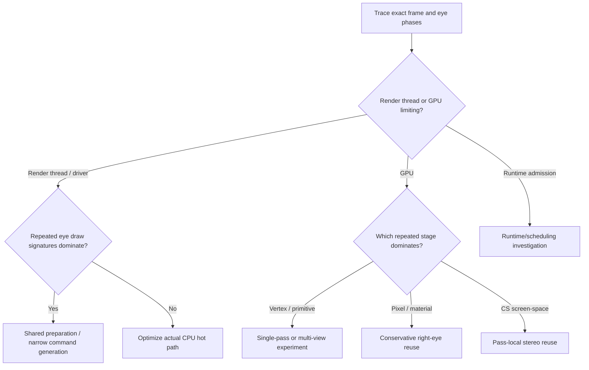

# Stereo Duplication and D3D11 Draw Submission

Status: **design baseline; standalone capability lab authorized, in-game implementation pending evidence**  
Date: 2026-08-16  
Review audience: Claude and the MGO/CSX collaborators

## Executive decision

The suspected opportunity is real enough to investigate, but it has not yet been
measured precisely enough to justify a renderer rewrite.

The recommended design is a staged **Stereo Work Reuse Layer (SWRL)**:

1. instrument the actual D3D11 command stream and establish where each eye begins;
2. measure paired-eye duplication by pass, draw signature, CPU cost, and GPU cost;
3. remove redundant work only in narrow, proven-safe domains;
4. expand from selected Community Shaders passes to conservative right-eye pixel
   reuse if the measured return warrants it;
5. consider engine-wide single-pass/multi-view rendering only if earlier stages
   prove that duplicated geometry and submission dominate.

This separates three costs too often collapsed into "stereo duplication":

- repeated Skyrim CPU scene/draw preparation;
- repeated D3D11 state changes and draw submission;
- repeated GPU geometry and pixel shading.

They need different remedies. A deferred context may reduce CPU recording cost but
does not halve GPU work. Stencil-based reprojection may reduce right-eye pixel work
but does not remove draw calls or vertex work. NVIDIA single-pass stereo can share
geometry, but requires a wide shader/pipeline conversion and does not make
view-dependent pixel shading free.

The first deliverable should therefore be an **observer**, not an optimizer. Its
measurements determine which implementation branch earns development effort.

## 1. Scope

### Goals

- Determine whether MGO 4.0 RC3/CSX 3.18 repeats scene submission per eye, which
  work is structurally identical, and how much wall time it costs.
- Attribute cost separately to Skyrim CPU preparation, D3D11 runtime/driver
  submission, GPU geometry, GPU pixel shading, and Community Shaders compute.
- Remain valid when the user changes HMD resolution, Pimax Image Quality, refresh
  mode, DLSS quality, or Pimax 72 Hz upscaled/Lab mode.
- Fail closed: ambiguous or visually risky content retains native stereo.
- Produce evidence that can support or reject a future implementation.

### Non-goals

- Do not change the Governor or render-scale transition mechanism.
- Do not claim that Skyrim draws two complete views until a trace proves it.
- Do not infer OpenXR compositor behavior from an in-process D3D11 timestamp.
- Do not make whole-frame reprojection, mono rendering, or deferred contexts a
  mandatory dependency.
- Do not hard-code 3494 x 3558, 72 Hz, or any Pimax/DLSS preset name.

## 2. Baseline and source authority

| Layer | Baseline |
|---|---|
| Game | Skyrim VR / MGO 4.0 beta RC3 |
| Renderer | ParticleTroned Community Shaders CSX 3.18 VR family |
| CS API build observed in RC3 | 11 |
| GPU/HMD | RTX 5090 / Pimax Crystal Super |
| Current capture | 72 Hz; 3494 x 3558 submitted per eye at Pimax IQ 0.75 |
| Bridge/runtime | OpenComposite 4.2.3 / Pimax OpenXR |

Those dimensions identify one capture; they are not design constants.

### Exact Community Shaders source

```text
tag:     CSX3.18
commit:  2051e2aead1b2bb2b03faa421201376e8bc84fe0
date:    2026-08-09T14:41:45+01:00
subject: chore(presets): align hair specular values
API:     CSBuildNumber = 11
```

All CSX 3.18 claims below were checked with `git show`/`git grep` against that tag,
not against the repository's active worktree (which is currently older). The tag
and observed plugin API build agree, but the installed DLL should still be
hash-matched to a release artifact before code ships. The older whole-frame
`VRStereoOptimizations` checkout remains prior art only.

### What current source proves

- CSX hooks `BSGraphics::SetDirtyStates`, invokes the original, then calls
  `State::Draw()`.
- `State::Draw()` performs CS resource/permutation work. Its debug path counts
  calls associated with the current shader. This is a useful engine-side boundary,
  not yet a complete trace of every D3D11 `Draw*` call.
- CSX intercepts `D3D11CreateDeviceAndSwapChain`, requests feature level 11.1,
  and retains the immediate context.
- Screen-space shadows contain a native path (separate left/right ray-marches)
  and a configurable stereo-reprojection path that skips the native right-eye
  ray-march when ready, then runs stereo reproject/sync work.
- SSGI carries two eye transforms and contains explicit stereo-reproject,
  stereo-sync, and center-stereo-sync passes. This is current pass-local reuse,
  not proof that Skyrim's general geometry submission is shared.
- Upscaling manipulates side-by-side resources and prepares eye output. Its cost
  must be timed, not inferred from layout.

### What source does not prove

It does not prove identical scene traversal, two copies of every geometry draw,
a CPU submission bottleneck, a continuously busy GPU, safe draw collapsing, or
correct behavior of an older prototype in the installed binary. Side-by-side
targets and two matrices do not reveal how much upstream work was shared.

## 3. Measured motivation

| DLSS rung | Mean application GPU ms |
|---|---:|
| UltraPerformance | 9.70 |
| Performance | 11.32 |
| Balanced | 12.59 |
| Quality | 13.50 |
| UltraQuality | 15.64 |
| Hoshipa | 16.75 |
| NativeAA | 20.81 |

```text
mean fit:               t = 8.22 + 12.34 f
corrected deduped P95:  t = 9.26 + 15.11 f
where:                  f = renderScale^2
```

The intercept is empirical, not a literal fixed-cost bucket. It can absorb
CPU/GPU bubbles, nonlinear passes, synchronization, and boundary effects. It is
still a reason to investigate the low-resolution floor.

At Performance, 11.0% of steady intervals missed versus 0.3% at
UltraPerformance; the app GPU reading was under budget for 73% of Performance
misses. Submission and scheduling must be studied alongside shaders. Measured
post-submit app GPU work was only 0.033–0.034 ms, but excludes the out-of-process
Pimax compositor.

## 4. Cost model

```text
T_frame = max(
    T_main_thread,
    T_render_thread + T_d3d11_runtime_driver,
    T_gpu_application,
    T_runtime_compositor_on_critical_path
)

T_render_thread = T_shared_prepare
                + T_eye0_prepare + T_eye1_prepare
                + T_state_and_draw_calls + T_CS_cpu

T_gpu_application = T_shared_gpu
                  + T_eye0_geometry + T_eye0_pixel
                  + T_eye1_geometry + T_eye1_pixel
                  + T_CS_shared + T_CS_per_eye
                  + T_upscale_output + T_idle_bubbles
```

For proposed reuse domain `p`:

```text
gross_potential(p) = duplicated_cost(p) * safe_reuse_fraction(p)

net_potential(p) = gross_potential(p)
                 - classification
                 - transfer_or_reprojection
                 - extra_union_visibility
                 - synchronization
```

`net_potential` must remain positive at P95, not just in a static average.

## 5. Decision tree



## 6. Proposed architecture: Stereo Work Reuse Layer

SWRL has four separable components. Only the first is mandatory.

### 6.1 StereoTrace — passive instrumentation

Responsibilities:

- stable frame IDs and engine phase labels;
- confidence-scored eye classification;
- actual `Draw*` and `Dispatch*` counts;
- bound-state/resource identities and layered signatures;
- sampled CPU call duration and calibrated GPU timestamp ranges;
- bounded binary output, never formatted per-draw logging;
- explicit lost-event and overhead reporting.

```text
Counters:  always-safe aggregates and phase timing
Capture:   bounded N-frame command/signature stream for lab use
```

Capture defaults off and stops automatically after a small frame count.

### 6.2 DuplicationAnalyzer — offline pairing

For each frame:

1. segment shared, eye 0, eye 1, CS, upscale, submit, and unknown phases;
2. align eye sequences while preserving command order;
3. report exact, eye-variant-only, similar, and unmatched pairs;
4. aggregate CPU/GPU time, draws, index/vertex estimates, and coverage;
5. calculate opportunity upper bounds, not promised savings.

```text
ExactStateAndGeometry
SameGeometryEyeConstantsDiffer
SameMaterialDifferentGeometry
TransparentOrOrderSensitive
ComputeStereoWide
ComputeExplicitEye0
ComputeExplicitEye1
Unknown
```

### 6.3 EligibilityClassifier — fail-closed safety

Reuse occurs only when an allow rule succeeds. Initially exclude:

- transparency, particles, fire, smoke, refraction, and water;
- alpha-tested foliage/hair until validated;
- POM/parallax/tessellation without correct eye depth;
- view-dependent materials and screen-space reflections;
- hands, weapons, VRIK body, and conservative near-field geometry;
- uncertain skinned objects;
- UAV/order-dependent draws, queries, predication, and indirect mutations;
- foveal regions when gaze is known, conservative center otherwise.

### 6.4 Independent reuse backends

```text
PassLocalStereoReuse
RightEyePixelReuse
SharedCpuPreparation
HardwareMultiView
```

No global switch silently combines all four.

## 7. Eye and phase identification

No one heuristic is enough. Combine:

- engine hook position and known phase boundaries;
- camera/view constant-buffer updates;
- viewport/scissor geometry;
- render-target subresource or side-by-side half;
- CSX feature markers;
- OpenVR eye submit order;
- offline sequence repetition.

A viewport confined to one side-by-side half is strong evidence. A full-width
compute dispatch is not; it can be stereo-wide, shared, or unrelated.

```cpp
enum class EyeClass : uint8_t {
    Shared, Left, Right, StereoWide, Unknown
};

struct EyeEvidence {
    EyeClass result;
    uint8_t confidence;   // descriptive 0..100
    uint16_t reasons;     // viewport, matrix, phase, RT, submit bits
};
```

Optimizers never act on `Unknown`; early prototypes require two agreeing signals.

## 8. Command trace design

### Event schema

```cpp
enum class CommandKind : uint8_t {
    Draw, DrawIndexed, DrawInstanced, DrawIndexedInstanced,
    DrawAuto, DrawIndirect, Dispatch, DispatchIndirect,
    PhaseBegin, PhaseEnd
};

struct TraceEvent {
    uint64_t frameId;
    uint32_t sequence;
    uint32_t cpuDeltaTicks;
    CommandKind kind;
    EyeClass eye;
    uint16_t phase;
    uint64_t geometryKey;
    uint64_t pipelineKey;
    uint64_t resourceKey;
    uint64_t eyeVariantKey;
    uint32_t arg0, arg1, arg2, flags;
};
```

Pointers are process-local identities only. Use creation generations to prevent
false matches after address reuse.

### Layered signatures

```text
geometryKey = topology + layout + vertex buffers/strides/offsets
            + index buffer/format/offset + draw arguments
pipelineKey = VS + HS + DS + GS + PS + rasterizer + blend + depth/stencil
resourceKey = non-eye CB/SRV/sampler identities + content generations
eyeVariantKey = viewport/scissor + view/projection generation + eye resources
```

A dynamic constant buffer can retain its pointer while changing content between
eyes. Track relevant `Map`/`Unmap`, `UpdateSubresource`, and copies as content
generations. Do not hash large buffers in the hot path.

### Hooking order

1. Stable Skyrim/CSX hooks for phase markers.
2. Only necessary immediate-context methods for bounded capture.
3. Runtime validation of interface/vtable assumptions.
4. No permanent whole-context proxy until compatibility is proven.

The older stereo prototype proves this source family has hooked context state
methods. It does not prove broad draw interception is overhead-free.

### Hot-path sketch

```cpp
void STDMETHODCALLTYPE Hook_DrawIndexed(ID3D11DeviceContext* ctx,
                                        UINT count, UINT start, INT base)
{
    if (TraceCapture::Active()) {
        TraceEvent e{};
        e.frameId = g_frameId.load(std::memory_order_relaxed);
        e.sequence = g_sequence++;
        e.kind = CommandKind::DrawIndexed;
        e.eye = g_phaseTracker.CurrentEye().result;
        e.phase = g_phaseTracker.CurrentPhase();
        e.geometryKey = g_stateShadow.GeometryKey(count, start, base);
        e.pipelineKey = g_stateShadow.PipelineKey();
        e.resourceKey = g_stateShadow.ResourceKey();
        e.eyeVariantKey = g_stateShadow.EyeVariantKey();
        e.arg0 = count;
        e.arg1 = start;
        e.arg2 = static_cast<uint32_t>(base);
        g_traceRing.TryPush(e); // count and flag overflow
    }
    g_originalDrawIndexed(ctx, count, start, base);
}
```

Production code adds recursion protection, safe init/teardown, interface checks,
and a no-throw hot path.

## 9. D3D11 submission analysis

### 9.1 Immediate-context reality

D3D11 has one immediate context whose commands execute in order. Context methods
are not generally free-threaded; device/resource creation has a different
threading model. CSX retains the immediate context returned during device setup.

Implications:

- many calls can impose CPU and driver validation/state-tracking cost;
- repeated calls do not prove repeated driver work because engine/driver state
  shadowing may already collapse it;
- CPU command production and GPU execution must be measured separately;
- reducing calls matters only when removed work is on the critical path.

### 9.2 Why deferred contexts are not the first solution

A deferred context records a command list for later immediate-context execution.
It helps renderers designed to build independent packages in parallel. Retrofitting
arbitrary Skyrim draws faces serious constraints:

- order and mutable state are part of the engine contract;
- maps, updates, queries, predication, hazards, and copies cross draw boundaries;
- command lists retain resource/state references, not a semantic "other eye";
- replay can reduce recording CPU but still executes every GPU draw;
- changing an eye constant between replays is unsafe when recorded commands update
  or consume it internally;
- `ExecuteCommandList` state restoration/synchronization can erase gains;
- small command lists can be slower than direct calls on a given driver.

Deferred contexts are a **conditional backend** for a large, isolated, immutable
sequence whose CPU cost and dependencies are proven.

```cpp
const UINT creationFlags = device->GetCreationFlags();

D3D11_FEATURE_DATA_THREADING threading{};
const HRESULT hr = device->CheckFeatureSupport(
    D3D11_FEATURE_THREADING, &threading, sizeof(threading));

// Record; never assume:
// threading.DriverConcurrentCreates
// threading.DriverCommandLists
```

A positive `DriverCommandLists` result proves capability, not performance.

### 9.3 Why blind redundant-state suppression is weak

Skipping apparent repeats of `PSSetShaderResources` or `OMSetBlendState` has a low
likely ceiling because Skyrim's `SetDirtyStates` path and the driver may already
avoid or cheaply absorb redundancy. Hidden state, content changes, reference
lifetimes, and graphics tools add risk.

Measure first:

```text
exact redundant bind count
render-thread time inside those calls
driver CPU samples attributed to them
GPU command-stream change in a laboratory suppression build
```

Never suppress a draw solely because signatures match.

### 9.4 Shared CPU preparation may be more valuable

If Skyrim repeats visibility traversal, sorting, material preparation, or
permutation selection, sharing it can save CPU without changing stereo image
formation:

```text
visibleUnion = ConservativeUnion(leftFrustum, rightFrustum)
packets = BuildAndSortDrawPacketsOnce(visibleUnion)
Submit(packets, leftView)
Submit(packets, rightView)
```

This keeps both-eye draws while sharing preparation. Union visibility can increase
GPU work, and a stable engine intervention point is not yet known. This is
engine/binary research, not a CSX-only shader change.

## 10. Optimization backend analysis

### 10.1 Pass-local reuse — recommended first GPU prototype

Start by evaluating CSX 3.18's existing pass-local stereo modes rather than
recreating them. Screen-space shadows can choose between native left/right
ray-marches and left-eye plus stereo reprojection/sync; SSGI contains explicit
reproject/sync passes. The first experiment should:

- compare native and current reuse modes with the same camera/configuration;
- inspect the current depth/disocclusion validity logic and visualize its mask;
- measure native right-eye work removed versus reproject/sync work added;
- validate unsafe-pixel and fallback behavior.

This limits correctness analysis to one effect and avoids Skyrim draw changes.

### 10.2 Right-eye material/pixel reuse — promising, high risk

The older `VRStereoOptimizations` prototype:

1. classified right-eye pixels using depth;
2. wrote eligible pixels into stencil;
3. modified depth/stencil state so those pixels skipped normal shading;
4. reprojected left-eye color into skipped right-eye pixels;
5. preserved full shading/blending at disocclusions, edges, near content, and
   special cases such as POM.

This is reachability evidence. It was disabled by default and is absent from CSX
3.18, so it is not proof of correctness or net performance.

It can remove portions of right-eye pixel shading/composition. It cannot remove
draw calls, CPU preparation, vertex work, raster setup, or unsafe pixels. It adds
classification, stencil intervention, reconstruction, synchronization, state
save/restore, and artifact handling.

Any successor begins in visualization mode and never overwrites an uncertain
right-eye pixel.

### 10.3 NVIDIA single-pass stereo/multi-view — long horizon

NVIDIA describes single-pass stereo as drawing geometry once and projecting it
into both eye views. Multi-view rendering generalizes geometry replication and
viewport projection. These target geometry submission and vertex duplication.

For Skyrim/CSX they require:

- verified support on the active D3D11 device/driver;
- two-eye projection data in affected vertex/domain/geometry shaders;
- correct viewport routing and side-by-side conventions;
- conservative stereo culling or union visibility;
- audit of clip distances, tessellation, geometry shaders, instancing, skinning,
  shadows, particles, alpha test, water, POM, and custom MGO materials;
- shader-cache/permutation changes across active CSX features;
- fallback for unsupported shaders/passes;
- compatibility with tools, overlays, and Streamline/DLSS.

It does not automatically share pixel shading. Pursue it only if vertex/submission
duplication is a large measured critical-path cost.

### 10.4 Geometry instancing as a bridge

A known shader family could use two instances, `SV_InstanceID` for eye data, and
viewport routing. It is not a drop-in rewrite: existing instancing gains an eye
dimension; routing may need a geometry stage or extension; per-eye resources and
culling remain; and unknown shaders cannot be safely patched at API level.

### 10.5 Monoscopic far field — separate idea

Distant content has low disparity and could use a cyclopean view. Incorrect cues
can still change perceived scale/depth. Keep this separate and require explicit
binocular testing.

## 11. Dynamic configuration and hardware agnosticism

Derive the operating envelope at runtime; never infer workload from a preset name.

### Runtime-derived inputs

```text
actual stereo target width and height
actual left/right viewport and scissor
actual submitted eye texture bounds
actual left/right projection and view matrices
actual display period
actual DLSS input/output extents
actual dynamic-resolution ratios
actual gaze validity/coordinates, if available
device creation flags and D3D11 threading capabilities
```

### Configuration epochs

Any change starts a new epoch and invalidates learned costs/masks:

```text
render/output dimensions
eye texture bounds or FOV
refresh mode
Pimax Image Quality
Pimax Lab/upscaled mode
DLSS mode or scale
CSX settings/shader-cache generation
driver/runtime/bridge version
active foveation or visibility-mask owner
```

Refresh controls deadline evaluation, not reuse geometry. Pimax IQ and Lab modes
may change size, compositor behavior, or margin; they must not silently alter
safety assumptions.

```cpp
struct StereoResourceKey {
    uint32_t fullWidth;
    uint32_t height;
    DXGI_FORMAT depthFormat;
    DXGI_FORMAT colorFormat;
    uint32_t sampleCount;
    uint64_t projectionEpoch;

    auto operator<=>(const StereoResourceKey&) const = default;
};
```

On a key change:

1. disable reuse for the current frame;
2. retire in-flight work without a global blocking flush where possible;
3. allocate and validate new resources;
4. clear temporal history and confidence masks;
5. re-enable after one native stereo frame establishes history.

SWRL does not switch CS render scale and never reuses resources across extents. It
therefore does not depend on the Governor's CS render-target relatch path.

## 12. Correctness and safety

### Fail-closed invariants

- Ambiguous phase/eye identity executes the original path.
- Missing resources, shaders, or capabilities execute the original path.
- Never reuse across size, projection, FOV, or shader-generation epochs.
- Never create conflicting read/write bindings to one subresource.
- Restore every modified state slot from a complete inventory.
- Never depend on `Flush()` for ordinary correctness.
- Trace overflow invalidates analysis, not rendering.
- Release builds default off until acceptance gates pass.

### Required visual corpus

- VRIK body, hands, weapons, bows, scopes, and near NPC faces;
- foliage, fences, grass, hair, alpha test, and thin silhouettes;
- particles, magic, fire, smoke, god rays, and precipitation;
- POM/parallax, complex materials, skin, wetness, snow, and subsurface effects;
- water, refraction, reflections, and shore transitions;
- shadows, SSGI, AO, and bright specular highlights;
- rapid translation, rotation, locomotion, turning, and eye motion;
- menus, loading screens, map, UI, overlays, and transitions;
- indoor, outdoor, city, forest, dungeon, combat, and worst-case MGO saves.

### Binocular metrics

Single-image PSNR/SSIM is insufficient. Record:

```text
left native vs left optimized error
right native vs right optimized error
disparity/depth-edge error
disocclusion hole and invalid-pixel area
foveal and near-field weighted error
temporal flicker/instability
left-right luminance and specular mismatch
human comfort under blinded A/B switching
```

## 13. Measurement and experiment plan

### Phase 0 — prove the bottleneck

Capture identical scenes at UltraPerformance, Quality, and NativeAA with:

- ETW/GPUView: Skyrim threads, NVIDIA queues, OpenComposite calls, and Pimax
  runtime processes;
- GPU profiler: per-pass timing, vertex/pixel workload, occupancy, and idle regions;
- CSX profiler/Tracy markers;
- StereoTrace counters/capture;
- Governor frame IDs, app GPU time, frame interval, and full config signature.

Deliverables:

```text
render-thread critical-path ms and P95/P99
actual Draw*/Dispatch counts by phase and eye
paired draw fraction by count and CPU time
paired geometry fraction by indices/vertices
eye0 and eye1 GPU cost by major pass
GPU idle/busy timeline
runtime/compositor overlap and admission evidence
instrumentation overhead and lost-event rate
```

Gate to Phase 1: eye segmentation is independently validated and instrumentation
changes frame P95 by less than 1% or 0.10 ms, whichever is stricter.

### Phase 1 — pass-local prototype

Choose one current CSX stereo implementation with meaningful measured savings,
explicit source ownership, deterministic I/O, and conservative validity rules.
Screen-space shadows and SSGI are the first candidates; benchmark their existing
native-versus-reproject switches before writing a new algorithm.

```text
P95 net GPU saving >= 0.30 ms in at least two costly scenes
no P99 regression > 0.10 ms in neutral scenes
zero unresolved binocular correctness defects
safe fallback verified under resize and projection changes
```

### Phase 2 — selective right-eye pixel reuse

Port only useful lessons from the old stencil prototype. Start with classification
visualization, then allow opaque, distant, low-disparity pixels in a tiny shader
allowlist. Classifier plus reconstruction should cost less than 35% of gross
removed work at P95 before expansion.

### Phase 3 — CPU preparation/submission prototype

Enter only if Phase 0 shows a render-thread/driver bottleneck with high paired-eye
duplication:

1. measure redundant state calls without suppressing them;
2. find repeated engine preparation above D3D11;
3. prototype packet reuse for one stable opaque shader family;
4. test a deferred command list only for a proven immutable sequence.

### Phase 4 — hardware multi-view feasibility

Enter only if duplicated vertex/submission cost is large and still unsolved. Build
a compatibility matrix per shader family before converting a whole pass.

## 14. Acceptance criteria

### Performance

- Report mean, P95, P99, and worst one-second window—not FPS alone.
- Improve the actual limiting component and delivered-frame behavior.
- Add no GPU idle bubbles, forced flushes, or frame-time bimodality.
- Remove capture overhead from release builds.
- Preserve gains at multiple resolutions and two runtime/refresh modes.

### Reliability

- Native path returns immediately after validation failure.
- Resize, device loss, loading, menus, alt-tab, and shader reload are tested.
- No crashes/stale resources in a two-hour representative session.
- Hooks are version/capability guarded and fail without corrupting D3D state.

### Visual quality

- No unresolved defect in the required corpus.
- No detectable binocular rivalry in blinded in-headset A/B tests.
- Diagnostic masks prove uncertain pixels stay native.
- Per-eye comparisons retain exact binary/config signatures.

### Agnosticism

- Use projection-derived/normalized quantities instead of inappropriate absolute
  pixel thresholds.
- Depend on no Pimax preset name.
- Create clean epochs automatically after resolution/projection change.
- Use measured milliseconds/current display period for performance policy and
  geometry/material evidence for safety policy.

## 15. Failure modes and mitigations

| Failure | Consequence | Mitigation |
|---|---|---|
| Wrong eye/phase classification | Wrong pixels/calls reused | Multi-signal confidence; unknown means native |
| Dynamic CB pointer treated as stable content | False draw pairing | Track update generations and known eye CBs |
| Stereo-wide dispatch assumed shared | Bad cost attribution | Mark `StereoWide`; inspect shader indexing |
| D3D11 state not fully restored | Later-pass corruption | Complete state inventory and debug layer |
| Resource read/write hazard | Undefined/unbound results | Explicit unbinds and subresource inventory |
| Deferred list crosses mutable dependency | Stale constants/resources | Only isolated immutable packages |
| Reprojection misses disocclusion | Holes/rivalry | Conservative tests and native uncertainty band |
| Near/POM/view-dependent reuse | Wrong depth/specular | Exclude until specialized handling exists |
| Reconfigure reuses history | Corruption/crash | Epoch, disable, rebuild, native history frame |
| Instrumentation perturbs frame | False conclusion | Fixed ring, bounded capture, overhead A/B |
| GPU work was not late-frame cause | No comfort benefit | Correlate with ETW/runtime admission |

## 16. Why this design is preferable

### Evidence-led

It does not assume "Skyrim draws everything twice." The observer measures actual
calls, pairing, CPU samples, GPU workload, and idle time before selecting an
architecture.

### Correct mechanism for each symptom

- CPU preparation duplication → shared preparation.
- API/driver pressure → reduce or package proven calls.
- vertex/primitive duplication → single-pass/multi-view.
- pixel/material duplication → conservative right-eye reuse.
- selected CS compute duplication → pass-local reuse.
- compositor admission failure → runtime/scheduling work.

### Agnostic to user changes

Geometry, resources, budgets, and epochs derive from live targets, matrices, eye
bounds, and display timing. HMD resolution, Pimax IQ, 72 Hz upscaled/Lab, DLSS,
or FOV can change without invalidating a hard-coded table. Reconfiguration falls
back to native stereo.

### Bounded blast radius

The first GPU optimization lives in one owned CSX pass. Whole-scene state hooks,
shader transformations, and engine visibility changes come later with proof gates.

### Respects D3D11's abstraction

A command list records commands; it does not understand eyes or make views
semantically interchangeable. Deferred contexts are used only where their
dependency model can be proven.

### Retains prior art without inheriting its claims

The old stencil work demonstrates hook points, classification, and reconstruction.
Default-off status and removal from the current line demand new visual/performance
proof.

## 17. Recommended first implementation package

Create a developer-only module inside the user-owned CSX fork, with no
image-changing code. Reuse or extract CSX's existing D3D11 hook-bank ownership;
do not install a second competing context detour from a standalone plugin.

```text
src/Instrumentation/
|-- D3D11HookBroker.h/.cpp
|-- StereoTrace.h/.cpp
|-- PhaseTracker.h/.cpp
|-- StateShadow.h/.cpp
|-- TraceRing.h/.cpp
`-- CaptureFormat.h
tools/stereo_trace_analyzer/
docs/development/stereo-trace-format.md
tests/stereo_trace/
|-- signature_tests.*
|-- alignment_tests.*
`-- corrupted_capture_tests.*
```

Version-one milestones:

1. device/context capability report;
2. aggregate `Draw*`/`Dispatch` counts with <0.10 ms P95 overhead;
3. validated frame and eye phase markers;
4. bounded two-frame binary capture;
5. offline paired-sequence report;
6. correlation with one GPU/ETW capture;
7. go/no-go memo selecting one Phase 1 branch.

No draw suppression, command replay, or reprojection belongs in version one.
The complete base/branch, upstream, testing, and work-package plan is in
[StereoFusion Implementation Roadmap](STEREOFUSION_IMPLEMENTATION_ROADMAP.md).

## 18. Questions for Claude's review

1. Does the installed Skyrim VR path expose a more reliable eye boundary than
   viewport/matrix inference?
2. Does `BSGraphics::SetDirtyStates` occur once per submitted game draw in every
   relevant pass, or are important `Draw*` calls outside it?
3. Which CSX 3.18 pass has the largest independently measured right-eye cost and
   the cleanest correctness domain?
4. Can current CSX profiling expose eye-separated GPU queries without serializing
   the pipeline?
5. Is there a stable engine hook above D3D11 where visibility/draw packets are
   rebuilt for the second eye?
6. Which old `VRStereoOptimizations` failures or removal reasons are known but not
   visible in source history?
7. Do Streamline/DLSS or OpenComposite retain assumptions that multi-view or
   stencil skipping would violate?
8. What smallest scene corpus captures MGO's worst alpha, POM, water, particle,
   and near-field behavior?

## 19. Sources

### Exact CSX 3.18 tagged sources

- [CSX 3.18 `Hooks.cpp`](https://github.com/ParticleTroned/skyrim-community-shaders/blob/2051e2aead1b2bb2b03faa421201376e8bc84fe0/src/Hooks.cpp)
- [CSX 3.18 `State.cpp`](https://github.com/ParticleTroned/skyrim-community-shaders/blob/2051e2aead1b2bb2b03faa421201376e8bc84fe0/src/State.cpp)
- [CSX 3.18 screen-space shadows](https://github.com/ParticleTroned/skyrim-community-shaders/blob/2051e2aead1b2bb2b03faa421201376e8bc84fe0/src/Features/ScreenSpaceShadows.cpp)
- [CSX 3.18 SSGI](https://github.com/ParticleTroned/skyrim-community-shaders/blob/2051e2aead1b2bb2b03faa421201376e8bc84fe0/src/Features/ScreenSpaceGI.cpp)
- [CSX 3.18 upscaling](https://github.com/ParticleTroned/skyrim-community-shaders/blob/2051e2aead1b2bb2b03faa421201376e8bc84fe0/src/Features/Upscaling.cpp)

### Local evidence and prior art
- [Earlier stereo optimization header](https://github.com/zerotrust-dev/skyrim-community-shaders/blob/169191563e227c68ce0ba79fb28d08de98c62905/src/Features/VRStereoOptimizations.h)
- [Earlier stereo optimization implementation](https://github.com/zerotrust-dev/skyrim-community-shaders/blob/169191563e227c68ce0ba79fb28d08de98c62905/src/Features/VRStereoOptimizations.cpp)
- [Corrected RC3 Governor capture](https://github.com/zerotrust-dev/CSQualityGovernorVR/tree/main/tests/data/rc3-2026-08-12-1710)
- [Verified stack baseline](STACK_BASELINE.md)
- [Measurement plan](MEASUREMENT_PLAN.md)

### External primary references

- [Microsoft: D3D11 device/context model](https://learn.microsoft.com/en-us/windows/win32/direct3d11/overviews-direct3d-11-devices-intro)
- [Microsoft: D3D11 multithreading](https://learn.microsoft.com/en-us/windows/win32/direct3d11/overviews-direct3d-11-render-multi-thread-intro)
- [Microsoft: record a command list](https://learn.microsoft.com/en-us/windows/win32/direct3d11/overviews-direct3d-11-render-multi-thread-render)
- [Microsoft: `CheckFeatureSupport`](https://learn.microsoft.com/en-us/windows/win32/api/d3d11/nf-d3d11-id3d11device-checkfeaturesupport)
- [NVIDIA: VRWorks Single Pass Stereo](https://developer.nvidia.com/vrworks/graphics/singlepassstereo)
- [NVIDIA: VRWorks Multi-View Rendering](https://developer.nvidia.com/vrworks/graphics/multiview)
- [Khronos: OpenXR 1.1 specification](https://registry.khronos.org/OpenXR/specs/1.1/html/xrspec.html)

## 20. Bottom line

The revolutionary target is not "make both eyes one image." It is **stop paying
twice for work whose eye dependence is small, while preserving native stereo for
everything uncertain**.

The credible route begins by proving which duplicated layer is on the critical
path. Pass-local CSX reuse is the best first GPU prototype; shared CPU preparation
is the best conceptual CPU target; broad command-list replay and engine-wide
single-pass stereo are conditional later projects, not the foundation.
